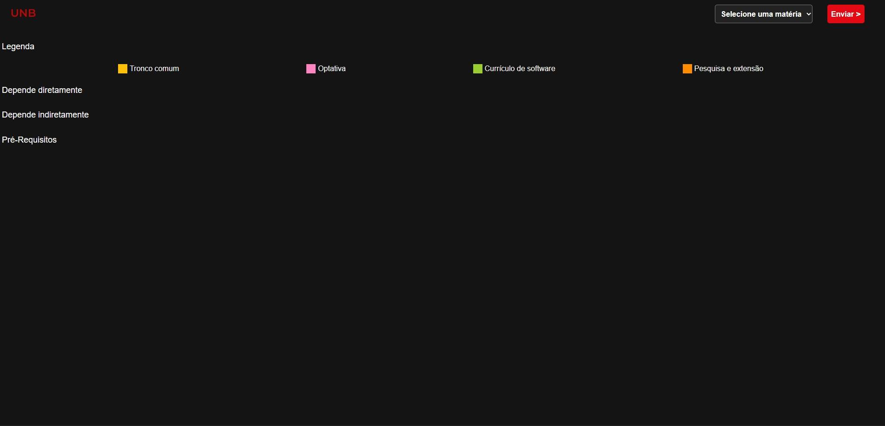
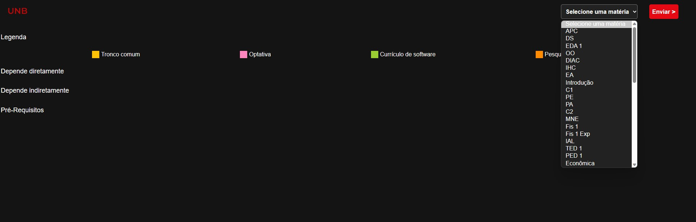
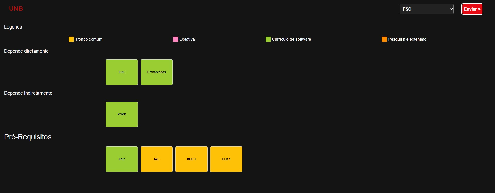

# Conectando Disciplinas

**Número da Lista**: X 
**Conteúdo da Disciplina**: Grafos 1 

## Alunos
|Matrícula | Aluno |
| -- | -- |
| 19/0042532  |  Felipe Alef Pereira Rodrigues |
| 18/0145509  |  Lucas Ramon Alves de Oliveira |

## Sobre 
O projeto proposto tem como objetivo identificar os pré-requisitos necessários para cursar uma determinada matéria em um fluxo acadêmico, bem como as matérias que dependem dela.

## Screenshots

## Instalação 
**Linguagem**: JS 
**Framework**: XXXXX 

## Uso 
Deploy do projeto foi feito usando o github pages.Para acessa-lo clique no link abaixo: 
https://projeto-de-algoritmos.github.io/Grafos1_ConectandoDisciplinas/

